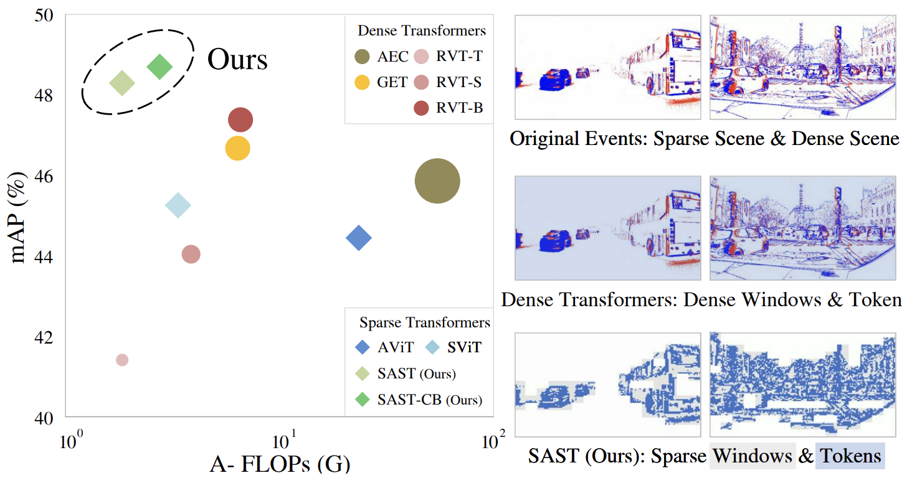

# SAST: Scene Adaptive Sparse Transformer for Event-based Object Detection
<p align="center">
  
</p>

This is the official Pytorch implementation of the CVPR 2024 paper [Scene Adaptive Sparse Transformer for Event-based Object Detection]

```bibtex
@InProceedings{peng2024sast,
  author  = {Yansong Peng and Hebei Li and Yueyi Zhang and Xiaoyan Sun and Feng Wu},
  title   = {Scene Adaptive Sparse Transformer for Event-based Object Detection},
  booktitle = {Proceedings of the IEEE/CVF Conference on Computer Vision and Pattern Recognition (CVPR)},
  year    = {2024},
}
```

## Conda Installation
```Bash
conda create -y -n rvt python=3.9 pip
conda activate sast
conda config --set channel_priority flexible

CUDA_VERSION=11.8

conda install -y h5py=3.8.0 blosc-hdf5-plugin=1.0.0 \
hydra-core=1.3.2 einops=0.6.0 torchdata=0.6.0 tqdm numba \
pytorch=2.0.0 torchvision=0.15.0 pytorch-cuda=$CUDA_VERSION \
-c pytorch -c nvidia -c conda-forge

python -m pip install pytorch-lightning==1.8.6 wandb==0.14.0 \
pandas==1.5.3 plotly==5.13.1 opencv-python==4.6.0.66 tabulate==0.9.0 \
pycocotools==2.0.6 bbox-visualizer==0.1.0 StrEnum=0.4.10
python -m pip install 'git+https://github.com/facebookresearch/detectron2.git'
```
Detectron2 is not strictly required but speeds up the evaluation.

## Required Data
To evaluate or train SAST you will need to download the required preprocessed datasets:

<table><tbody>
<th valign="bottom"></th>
<th valign="bottom">1 Mpx</th>
<th valign="bottom">Gen1</th>
<tr><td align="left">pre-processed dataset</td>
<td align="center"><a href="https://download.ifi.uzh.ch/rpg/RVT/datasets/preprocessed/gen4.tar">download</a></td>
<td align="center"><a href="https://download.ifi.uzh.ch/rpg/RVT/datasets/preprocessed/gen1.tar">download</a></td>
</tr>
<tr><td align="left">crc32</td>
<td align="center"><tt>c5ec7c38</tt></td>
<td align="center"><tt>5acab6f3</tt></td>
</tr>
</tbody></table>

You may also pre-process the dataset yourself by following the [instructions](scripts/genx/README.md).

## Evaluation
- Set `DATA_DIR` as the path to either the 1 Mpx or Gen1 dataset directory
- Set `CKPT_PATH` to the path of the *correct* checkpoint matching the choice of the model and dataset.
- Set
  - `USE_TEST=1` to evaluate on the test set, or
  - `USE_TEST=0` to evaluate on the validation set
- Set `GPU_ID` to the PCI BUS ID of the GPU that you want to use. e.g. `GPU_ID=0`.
  Only a single GPU is supported for evaluation
### 1 Mpx
```Bash
python validation.py dataset=gen4 dataset.path=${DATA_DIR} checkpoint=${CKPT_PATH} \
use_test_set=${USE_TEST} hardware.gpus=${GPU_ID} batch_size.eval=8
```
### Gen1
```Bash
python validation.py dataset=gen1 dataset.path=${DATA_DIR} checkpoint=${CKPT_PATH} \
use_test_set=${USE_TEST} hardware.gpus=${GPU_ID} batch_size.eval=8
```

## Training
- Set `DATA_DIR` as the path to either the 1 Mpx or Gen1 dataset directory
- The training code uses [W&B](https://wandb.ai/) for logging during the training.
Hence, we assume that you have a W&B account. 
  - The training script below will create a new project called `SAST`. Adapt the project name and group name if necessary.
 
### 1 Mpx
```Bash
TRAIN_WORKERS_PER_GPU=6 
EVAL_WORKERS_PER_GPU=2 
GPU_NUMBER=$(nvidia-smi --list-gpus | wc -l) 
GPUS=$(seq -s "," 0 $((GPU_NUMBER - 1))) 
BATCH_SIZE_PER_GPU=4 
DATA_DIR=/home/pengys/Data/gen4/ 
lr=$(python -c "import math; print(2e-4*math.sqrt(${BATCH_SIZE_PER_GPU}*${GPU_NUMBER}/8))") 
python train.py model=rnndet dataset=gen4 dataset.path=${DATA_DIR} wandb.project_name=SAST 
wandb.group_name=1mpx hardware.num_workers.train=${TRAIN_WORKERS_PER_GPU} 
batch_size.train=${BATCH_SIZE_PER_GPU} hardware.num_workers.eval=${EVAL_WORKERS_PER_GPU} 
batch_size.eval=${BATCH_SIZE_PER_GPU} hardware.gpus=[${GPUS}] 
training.learning_rate=${lr} validation.val_check_interval=10000
```
### Gen1
```Bash
TRAIN_WORKERS_PER_GPU=6 
EVAL_WORKERS_PER_GPU=2 
GPU_NUMBER=$(nvidia-smi --list-gpus | wc -l) 
GPUS=$(seq -s "," 0 $((GPU_NUMBER - 1))) 
BATCH_SIZE_PER_GPU=4 
DATA_DIR=/home/pengys/Data/gen1/ 
lr=$(python -c "import math; print(2e-4*math.sqrt(${BATCH_SIZE_PER_GPU}*${GPU_NUMBER}/8))") 
python train.py model=rnndet dataset=gen1 dataset.path=${DATA_DIR} wandb.project_name=SAST 
wandb.group_name=gen1 hardware.num_workers.train=${TRAIN_WORKERS_PER_GPU} 
batch_size.train=${BATCH_SIZE_PER_GPU} hardware.num_workers.eval=${EVAL_WORKERS_PER_GPU} 
batch_size.eval=${BATCH_SIZE_PER_GPU} hardware.gpus=[${GPUS}] 
training.learning_rate=${lr} validation.val_check_interval=10000
```

## Code Acknowledgments
This project has used code from the following projects:
- [timm](https://github.com/huggingface/pytorch-image-models) for the MaxViT layer implementation in Pytorch
- [YOLOX](https://github.com/Megvii-BaseDetection/YOLOX) for the detection PAFPN/head